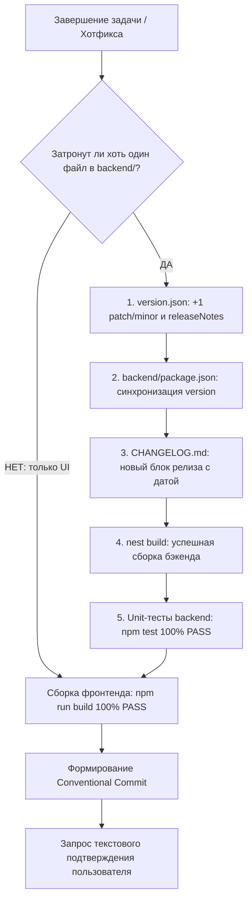

# Фаза 5: Регламент релиза и завершения работы (After Work)

Данный регламент определяет обязательные действия после успешного завершения задачи, разработки фичи, рефакторинга или исправления бага.

---

## 0. 🔒 Блокирующий передрелизный шлюз (Pre-Completion Checklist Gate)

> [!IMPORTANT]
> **Принцип предотвращения туннельного фокуса (Anti-Hotfix Tunnel Vision)**:
> Перед тем как сформировать финальный ответ пользователю о завершении ЛЮБОЙ задачи или хотфикса, агент ОБЯЗАН выполнить автоматическую проверку контрольного шлюза:



### Правила шлюза:
1. **Фільтр файлов бэкенда**: Изменен хотя бы один файл в `backend/` (DTO, сервис, контроллер, сущность, схема, конфигурация)?
   - **ЯКЩО ТАК**:
     - `version.json` — версия обязательно увеличена (+1 patch/minor), детальное описание добавлено в `releaseNotes`.
     - `backend/package.json` — поле `"version"` синхронизировано в точности.
     - `CHANGELOG.md` — добавлен новый блок релиза с датой и детальным описанием изменений.
     - `nest build` — бэкенд успешно собран с новой версией.
   - **ЯКЩО НІ** (сугубо визуальные правки UI без затрагивания бэкенда): подъем версии бэкенда не требуется.
2. **Проверка целостности (Integrity Check)**:
   - Unit-тесты бэкенда (`npm test` в `backend/`) — 100% PASS.
   - Сборка фронтенда (`npm run build` во `frontend/`) — 100% PASS.
3. **Контрактная дисциплина**: Любая правка DTO или API-контракта ОБЯЗАТЕЛЬНО требует синхронного бампа версии для корректной работы систем автообновления и OTA клиентов.
4. **Автоматическая верификация (Gatekeeper Script)**: Запуск скрипта `python scripts/verify_release_gate.py` (или `src/sdd-agent/scripts/verify_release_gate.py`) для аппаратного подтверждения отсутствия пропусков в триаде файлов.
5. **Четкое разграничение статусов готовности (Explicit Readiness Status)**:
   - **Уровень 1: Локальная верификация (Local Build & Unit Tests Passed)** — код скомпилирован, линтеры и тесты пройдены в локальной среде dev. Рантайм не проверялся.
   - **Уровень 2: Эксплуатационная верификация (Deployed & Live Runtime Verified)** — сервис физически запущен, проверен через реальные сетевые вызовы, вебсокеты, UI или логи запущенного процесса.
   - *Запрещено выдавать локальную компиляцию за полную готовность на живом сервере без явного указания факта отсутствия рантайм-проверки.*

---


## 1. Обязательный чек-лист релиза (3 столпа завершения)

После успешного прохождения всех тестов и проверок:

### Шаг 1: Обновление `CHANGELOG.md`
Добавить запись в `CHANGELOG.md` в формате Keep a Changelog:
- `Added`: для новой функциональности.
- `Changed`: для изменений в существующей функциональности.
- `Deprecated`: для функций, которые скоро будут удалены.
- `Removed`: для удаленного функционала.
- `Fixed`: для исправления багов.
- `Security`: при устранении уязвимостей.

### Шаг 2: Синхронное увеличение версии (`+1` Bump)
Обновить версию во всех файлах манифеста проекта:
- `version.json` (включая массив `releaseNotes`)
- `backend/package.json`
- `frontend/package.json` (при релизах клиентской части)
- **Patch (+0.0.1)**: Обратно совместимые исправления багов и микро-правки.
- **Minor (+0.1.0)**: Обратно совместимый новый функционал.
- **Major (+1.0.0)**: Критические несовместимые изменения API.

### Шаг 3: Формирование Conventional Commit сообщения
Сформировать структурированное сообщение для коммита на ревью пользователю:

```
<тип>(<скоуп>): <краткое описание>

- <подробный пункт 1>
- <подробный пункт 2>

[Closes #issue / Refs #ticket]
```

**Разрешенные типы**:
- `feat`: Новая функциональность.
- `fix`: Исправление ошибки.
- `refactor`: Изменение кода без изменения поведения и без добавления фич.
- `perf`: Улучшение производительности.
- `test`: Добавление или корректировка тестов.
- `docs`: Изменения в документации.
- `chore`: Обслуживание, зависимости, конфигурация сборки.

---

## 2. Защитный барьер Git (Git Approval Safeguard)

> [!CAUTION]
> **Обязательное подтверждение пользователя**:
> Агенту КАТЕГОРИЧЕСКИ ЗАПРЕЩЕНО автоматически выполнять команды `git commit` и `git push`. Всегда представлять предложенное сообщение коммита, диффы changelog и увеличение версии в чате и запрашивать явное текстовое одобрение пользователя.

