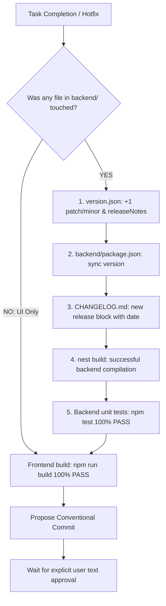

# Phase 6: Release & Post-Execution Protocol (After Work & Release Gate)

This protocol defines the mandatory release, versioning, and verification workflow following any feature development, refactoring, or bugfix.

---

## 0. 🔒 Pre-Completion Checklist Gate

> [!IMPORTANT]
> **Anti-Hotfix Tunnel Vision Invariant**:
> Prior to delivering any completion report for ANY task or hotfix, the agent MUST execute the automated checklist gate verification:



### Gate Rules:
1. **Backend File Filter**: Was at least one file modified under `backend/` (DTO, service, controller, entity, schema, configuration)?
   - **IF YES**:
     - `version.json` — Version MUST be incremented (+1 patch/minor), with detailed entries added to `releaseNotes`.
     - `backend/package.json` — The `"version"` field must be synchronized identically.
     - `CHANGELOG.md` — A new release entry added with timestamp and categorized changes.
     - `nest build` — Backend must compile cleanly with the updated version.
   - **IF NO** (Purely visual UI adjustments with zero backend modifications): Backend version bump is not required.
2. **Integrity Check**:
   - Backend unit tests (`npm test` in `backend/`) — 100% PASS.
   - Frontend build (`npm run build` in `frontend/`) — 100% PASS.
3. **Contract Discipline**: Any DTO or API contract modification MUST trigger a synchronized version bump to guarantee client auto-update and OTA compatibility.
4. **Automated Gatekeeper**: Execute `python scripts/verify_release_gate.py` to programmatically confirm integrity across all versioning files.
5. **Explicit Readiness Status (No False Reports)**:
   - **Level 1: Local Verification (Local Build & Unit Tests Passed)**: Code compiles, linters pass, and unit tests pass locally. Runtime execution was NOT verified.
   - **Level 2: Operational Verification (Deployed & Live Runtime Verified)**: Service is physically running and verified via live endpoints, WebSockets, UI interactions, or active container logs.
   - *Never represent local compilation as live runtime readiness without explicitly stating the lack of runtime verification.*

---

## 1. Mandatory Release Checklist (The 3 Pillars of Release)

Following the successful passage of all automated test suites and gatekeeper checks:

### Step 1: Update `CHANGELOG.md`
Add a release entry in Keep a Changelog format:
- `Added`: for new features.
- `Changed`: for changes in existing functionality.
- `Deprecated`: for soon-to-be-removed features.
- `Removed`: for now-removed features.
- `Fixed`: for any bug fixes.
- `Security`: in case of vulnerabilities.

### Step 2: Synchronous Version Increment (`+1` Bump)
Update the version string across all project manifests:
- `version.json` (including the `releaseNotes` array)
- `backend/package.json`
- `frontend/package.json` (for client releases)
- **Patch (+0.0.1)**: Backwards-compatible bug fixes and minor adjustments.
- **Minor (+0.1.0)**: Backwards-compatible new functionality.
- **Major (+1.0.0)**: Breaking architectural or API changes.

### Step 3: Propose Conventional Commit Message
Format a structured commit message for user review:

```
<type>(<scope>): <short summary>

- <detailed item 1>
- <detailed item 2>

[Closes #issue / Refs #ticket]
```

**Allowed Types**:
- `feat`: New feature.
- `fix`: Bug fix.
- `refactor`: Code restructuring without behavioral change.
- `perf`: Performance enhancement.
- `test`: Adding or correcting tests.
- `docs`: Documentation updates.
- `chore`: Maintenance, dependencies, build configurations.

---

## 2. Git Approval Safeguard

> [!CAUTION]
> **Mandatory User Confirmation**:
> Executing `git commit` or `git push` automatically without user sign-off is **STRICTLY PROHIBITED**. Always propose the commit message, changelog diff, and version increments in chat, awaiting explicit human approval before running git write operations.
