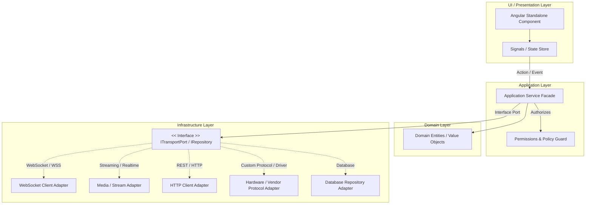
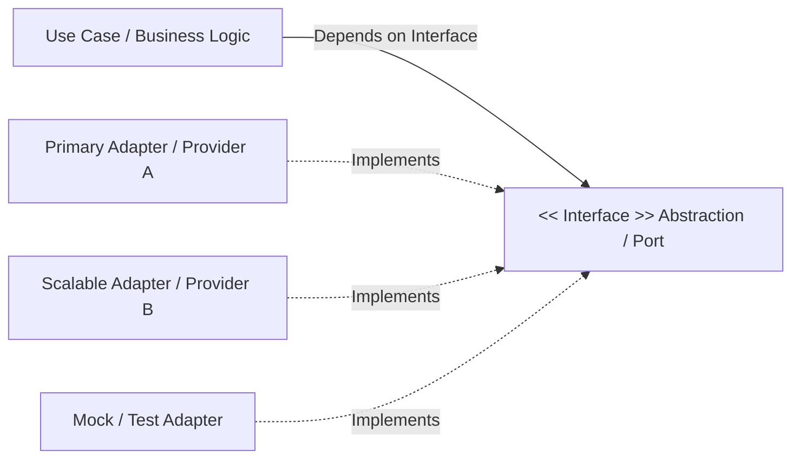

# Фаза: Архитектура, управление состоянием и Zero-Config (Architecture & State)

Данный регламент описывает принципы слоистой архитектуры, соответствия сквозному потоку данных из `docs/ARCHITECTURE.md`, управление реактивным состоянием и правила Zero-Config.

---

## 1. Слоистая архитектура и сквозной E2E Flow (`docs/ARCHITECTURE.md`)

Каждое изменение в системе должно четко укладываться в сквозной маршрут и распределение по слоям:

### Слои ответственности:
1. **Domain Layer (Слой домена)**:
   - Содержит чистые бизнес-сущности, интерфейсы, Value Objects и доменные инварианты из `docs/ABSTRACT.md`.
   - **Не зависит ни от каких внешних библиотек**, UI-фреймворков или базы данных.
2. **Application / Service Layer (Слой сценариев)**:
   - Реализует конкретные сценарии использования (Use Cases), валидацию и бизнес-логику.
   - Координирует передачу данных между доменом и инфраструктурой.
3. **Infrastructure / Data Access Layer (Слой инфраструктуры)**:
   - Реализация репозиториев, HTTP-клиентов, адаптеров БД, работы с вебсокетами и протоколами оборудования.
4. **UI / Presentation Layer (Слой представления)**:
   - Компоненты, шаблоны, стили.
   - **Запрещено размещать тяжелую бизнес-логику в UI-компонентах** — они только отображают состояние и вызывают методы сервисов.

---

## 2. Обязательный слой абстракции и масштабирования (Extensibility & Decoupling Layer)

> [!IMPORTANT]
> **Принцип обязательной расширяемости (Extensibility by Default)**:
> При проектировании и создании ЛЮБЫХ новых сущностей, сервисов или модулей агент **ОБЯЗАН ВСЕГДА** предлагать и включать в архитектуру вариант с **дополнительной прослойкой абстракции** (интерфейсы, порты/адаптеры, сервис-фасады, репозитории, драйверные слои).

### Зачем нужна прослойка абстракции:
1. **Слабое связывание (Low Coupling)**: Бизнес-логика или UI не зависят от конкретной реализации (HTTP-клиент, ORM, SDK внешней системы, провайдер авторизации/платежей).
2. **Легкость масштабирования и замены**: При необходимости перейти с одной БД на другую, сменить провайдера вебсокетов или масштабировать сервис — меняется ТОЛЬКО адаптер/реализация, в то время как весь домен остается нетронутым.
3. **Изолированное тестирование (Mockability)**: Интерфейс абстракции позволяет легко подменять реальные зависимости легковесными моками в тестах (Given-When-Then).

### Паттерны прослоек абстракции:
- **Port / Adapter (Hexagonal)**: Домен объявляет порт (интерфейс `INotificationPort`), а инфраструктура предоставляет адаптеры (`TelegramNotificationAdapter`, `EmailNotificationAdapter`, `WsNotificationAdapter`).
- **Repository Interface**: Сервисы зависят от `IUserRepository`, а не напрямую от `TypeORM / Mongoose / Prisma`.
- **Service Facade / Gateway**: Фронтенд-компоненты вызывают фасад сервиса модуля, скрывающий внутри множественные API-эндпоинты и маппинг DTO.
- **Strategy & Driver Layer**: Для драйверов оборудования (ESP32, VPN-движки, криптографические модули) всегда создается базовый абстрактный драйвер-интерфейс.

---

## 3. Управление состоянием (State Management)

1. **Однонаправленный поток данных (Unidirectional Data Flow)**:
   - Состояние изменяется только через явные действия (Actions/Events/Methods) в сервисах/сторах.
   - Компоненты получают данные только для чтения (Readonly Signals, Observables, Selectors).
2. **Запрет на прямую мутацию (Immutability)**:
   - Никогда не мутировать объекты или массивы состояния напрямую (`state.items.push(x)` ❌).
   - Всегда создавать новые иммутабельные копии (`[...state.items, x]` ✅) или использовать встроенные механизмы реактивности фреймворка (Signals `update()`).
3. **Очистка ресурсов (Unsubscribe / Effect Cleanup)**:
   - Предотвращать утечки памяти: отписываться от RxJS подписок (`takeUntilDestroyed()`, `destroy$`) или очищать таймеры при уничтожении компонентов.

---

## 4. Zero-Config и относительные API-пути

1. **Только относительные пути на фронтенде**:
   - Запрещено хардкодить адреса хостов (`http://localhost:3000`, `http://192.168.1.50:8080`).
   - Использовать исключительно относительные пути (`/api/v1/...`) или динамический `window.location.origin`.
2. **Динамический бэкенд**:
   - Порты, CORS-источники и сетевые интерфейсы конфигурируются строго через переменные окружения.
   - Приложение должно без пересборки запускаться на любом хосте или в Docker-контейнере.

---

## 5. Чек-лист архитектуры

- [ ] Создан и описан вариант с дополнительной прослойкой абстракции (интерфейс, порт/адаптер, фасад) для будущей масштабируемости.
- [ ] Бизнес-логика вынесена в сервисы, компоненты остаются тонкими.
- [ ] Состояние иммутабельно и обновляется однонаправленно.
- [ ] Сетевые пути относительны (`/api/...`), отсутствуют захардкоженные IP.
- [ ] Ресурсы и подписки корректно очищаются.

