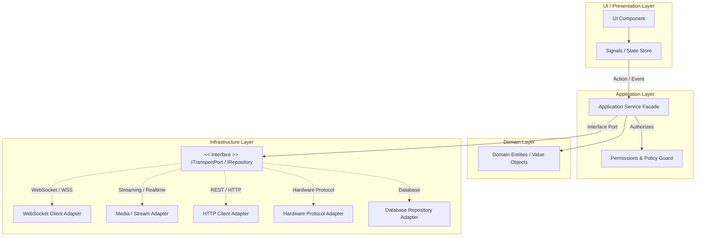
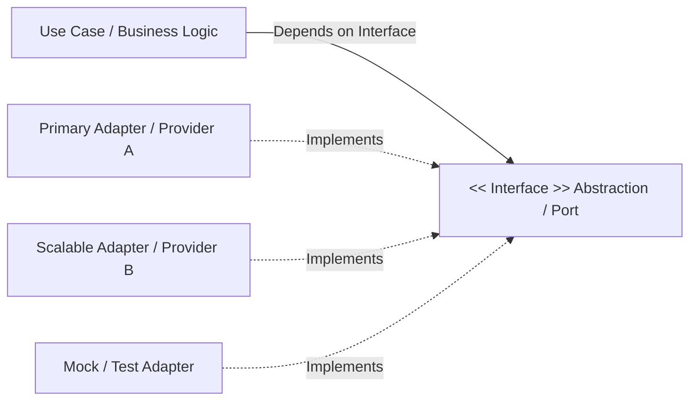

# Architecture, State Management & Zero-Config Protocol

This protocol defines the principles of layered architecture, alignment with end-to-end data flows in `docs/ARCHITECTURE.md`, reactive state management, and Zero-Config standards.

---

## 1. Layered Architecture & E2E Tracing (`docs/ARCHITECTURE.md`)

Every change in the codebase must strictly map into the system's end-to-end flow and architectural layers:

### Architectural Layer Responsibilities:
1. **Domain Layer**:
   - Contains pure business entities, value objects, and domain invariants from `docs/ABSTRACT.md`.
   - **Zero external dependencies**: completely independent of UI frameworks, HTTP clients, and database engines.
2. **Application / Service Layer**:
   - Implements concrete Use Cases, workflows, and business validation.
   - Coordinates data transfer between Domain and Infrastructure layers.
3. **Infrastructure / Data Access Layer**:
   - Implements repositories, HTTP clients, DB adapters, WebSocket connections, and hardware protocols.
4. **UI / Presentation Layer**:
   - Components, templates, and presentation styles.
   - **Zero heavy business logic in components**: components only render state and trigger service methods.

---

## 2. Mandatory Decoupling & Abstraction Layer (Extensibility by Default)

> [!IMPORTANT]
> **Extensibility by Default**:
> When designing and creating ANY new entity, service, or module, the agent MUST ALWAYS include an **abstraction layer** (interfaces, ports/adapters, service facades, repositories, driver layers).

### Benefits:
1. **Low Coupling**: Business logic and UI remain insulated from specific libraries (HTTP clients, ORMs, vendor SDKs).
2. **Seamless Scaling & Swapping**: Migrating databases or changing transport libraries requires changing ONLY the adapter, leaving the domain untouched.
3. **Test Isolation (Mockability)**: Interfaces enable lightweight mocking in unit and integration test suites.

### Abstraction Patterns:
- **Port / Adapter (Hexagonal)**: The domain declares the port (`INotificationPort`), infrastructure implements adapters (`EmailAdapter`, `WsAdapter`).
- **Repository Interface**: Services depend on `IUserRepository`, never directly on TypeORM, Mongoose, or Prisma.
- **Service Facade**: UI components invoke a module facade that hides multiple backend endpoints and DTO conversions.
- **Strategy & Driver Interface**: For hardware or streaming drivers (ESP32, WebRTC, CRSF), declare an abstract driver interface.

---

## 3. Reactive State Management

1. **Unidirectional Data Flow**:
   - State updates occur strictly via explicit methods/actions in services and stores.
   - Components consume readonly signals, observables, or selectors.
2. **Immutability**:
   - Never mutate state objects or arrays in place (`state.items.push(x)` ❌).
   - Produce new immutable copies (`[...state.items, x]` ✅) or use framework reactivity updates (`signal.update()`).
3. **Resource & Subscription Cleanup**:
   - Prevent memory leaks: unsubscribe from RxJS streams (`takeUntilDestroyed()`, `destroy$`) and clear active intervals on component destruction.

---

## 4. Zero-Config & Relative Paths

1. **Relative Paths on Frontend**:
   - Never hardcode host addresses (`http://localhost:3000`, `http://192.168.1.50:8080`).
   - Use relative `/api/v1/...` routes or dynamic `window.location.origin`.
2. **Dynamic Backend**:
   - Ports, CORS origins, and interfaces must configure via environment variables.
   - Deployable across local dev, staging, or Docker containers without recompilation.

---

## 5. Architecture Verification Checklist

- [ ] Designed an abstraction layer (interface, port/adapter, facade) for future extensibility.
- [ ] Business logic resides in services; presentation components remain lightweight.
- [ ] State mutations are immutable and unidirectional.
- [ ] Network routes use relative `/api/...`; zero hardcoded IPs.
- [ ] Subscriptions and event listeners are properly torn down upon destruction.
