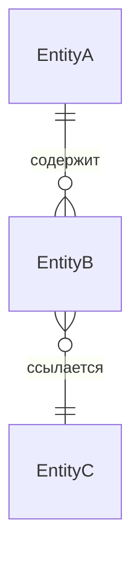
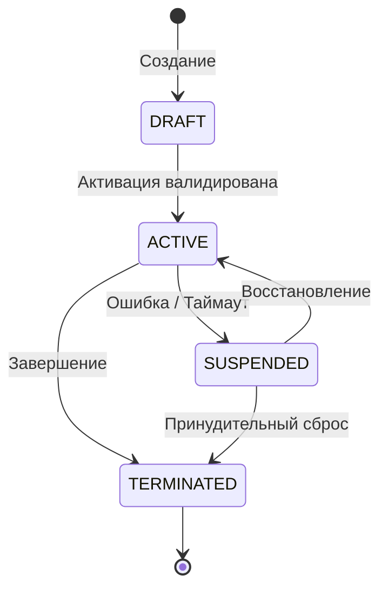

# [Имя проекта]: Концептуальная спецификация (`docs/ABSTRACT.md`)

> **Назначение документа**: Определение доменной модели, границ контекста (Bounded Contexts), матрицы прав доступа и нерушимых системных инвариантов. Документ служит канонической основой для Фазы 1 (Концептуальный фильтр) SDD-пайплайна.

---

## 1. Миссия системы и Bounded Contexts

### 1.1. Главная цель (System Purpose)
*Краткое описание назначения системы: какую ключевую бизнес- или инженерную задачу она решает, кто ее основные пользователи и какие ключевые результаты ожидаются.*

### 1.2. Границы контекстов (Bounded Contexts)
*Перечень изолированных функциональных подсистем/модулей проекта и их зоны ответственности:*
- **[Контекст 1, например: Identity & Auth]**: Регистрация, аутентификация, управление ролями и сессиями.
- **[Контекст 2, например: Core Domain / Engine]**: Основная бизнес-логика выполнения операций.
- **[Контекст 3, например: Telemetry & Monitoring]**: Сбор, агрегация и стриминг метрик / логов.
- **[Контекст 4, например: Hardware / External Gateway]**: Интеграция с физическими устройствами или внешними провайдерами.

---

## 2. Глоссарий и доменные сущности (Entities & Value Objects)

*Канонические сущности домена. Изменение их состава или семантики требует обновления этого документа.*

| Сущность / VO | Тип | Описание | Ключевые атрибуты |
| :--- | :--- | :--- | :--- |
| `[EntityName]` | Entity | *Что представляет в предметной области* | `id: UUID`, `status: StatusEnum`, `createdAt` |
| `[ValueObjectName]` | Value Object | *Неизменяемый атрибут-значение (email, координаты, деньги)* | `value: string`, методы валидации |

### Отношения между сущностями

---

## 3. Матрица субъектов, прав и авторизации $P(S, A, R, C)$

*Правило разграничения доступа: субъект $S$ выполняет действие $A$ над ресурсом $R$ в контексте условий $C$.*

### 3.1. Субъекты (Subjects / Actors)
- **`Guest` / `Anonymous`**: Неавторизованный пользователь.
- **`User` / `Operator`**: Базовый авторизованный пользователь системы.
- **`Admin` / `Superuser`**: Администратор с полным доступом к конфигурации.
- **`System` / `Internal Worker`**: Внутренний системный процесс, демон или воркер.

### 3.2. Матрица разрешений

| Субъект ($S$) | Ресурс ($R$) | Действие ($A$) | Контекст / Условие ($C$) |
| :--- | :--- | :--- | :--- |
| `User` | `Device` | `Read` | Только устройства своей организации |
| `Operator` | `Session` | `Control` | Активная сессия, статус `RUNNING`, отсутствие блокировки |
| `Admin` | `Configuration` | `Modify` | Всегда при наличии 2FA |
| `System` | `AuditLog` | `Append` | Автоматически на каждое бизнес-событие |

---

## 4. Системные инварианты (System Invariants)

*Нерушимые правила системы, которые ни при каких условиях не могут быть нарушены кодом.*

1. **Single Source of Truth (SSOT)**:
   - *Где находится каноническое состояние?* (Например: база данных PostgreSQL для метаданных; Redis Cluster для активных real-time сессий).
   - *Запрет на дублирование*: локальные кэши не должны иметь собственного независимого состояния.

2. **Fail-Safe & Graceful Degradation**:
   - Каково поведение системы при аварии, обрыве сети или отказе сервиса?
   - (Например: при потере связи с сервером клиент переходит в безопасный режим `READ_ONLY`, исполнительные механизмы глушатся, тайм-ауты сбрасывают блокировки).

3. **Concurrency & Exclusive Ownership**:
   - Правила одновременного доступа к критическим ресурсам.
   - (Например: монопольное владение управлением сессией `Single Operator Ownership`; распределенный lock через Redis/ETCD с TTL).

4. **Audit & Traceability**:
   - Все мутирующие операции обязаны порождать аудит-событие с идентификатором инициатора (`userId` / `traceId`).

---

## 5. Стейт-машины ключевых сущностей (Lifecycle State Machines)

