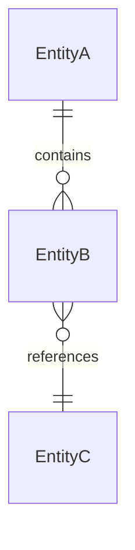
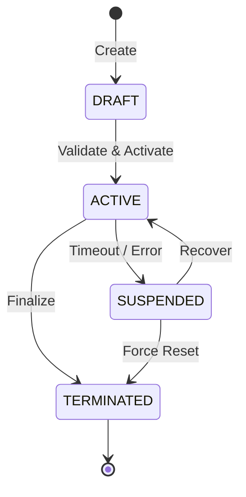

# [Project Name]: Conceptual Specification (`docs/ABSTRACT.md`)

> **Document Purpose**: Establishes the domain model, bounded contexts, permission matrix $P(S, A, R, C)$, and unbreakable system invariants. Serves as the canonical baseline for Phase 1 (Conceptual Filter) of the SDD pipeline.

---

## 1. System Mission & Bounded Contexts

### 1.1. System Purpose
*A concise description of the system purpose: what core business or engineering problem it solves, primary users, and expected outcomes.*

### 1.2. Bounded Contexts
*List of decoupled functional subsystems/modules and their respective domains:*
- **[Context 1, e.g., Identity & Auth]**: Registration, authentication, role and session management.
- **[Context 2, e.g., Core Engine / Domain]**: Core business operations, scheduling, and execution.
- **[Context 3, e.g., Telemetry & Streaming]**: Metric aggregation, event broadcasting, and real-time streaming.
- **[Context 4, e.g., Hardware & External Gateway]**: Physical device drivers, peripherals, and third-party vendor APIs.

---

## 2. Domain Entities & Value Objects

*Canonical domain models. Changes to these entities or their semantics require updating this document.*

| Entity / Value Object | Type | Description | Key Attributes |
| :--- | :--- | :--- | :--- |
| `[EntityName]` | Entity | *Domain representation* | `id: UUID`, `status: StatusEnum`, `createdAt: ISO8601` |
| `[ValueObjectName]` | Value Object | *Immutable domain value (e.g., Email, Coordinates, Money)* | `value: string`, validation routines |

### Entity Relationships

---

## 3. Subject, Permission & Authorization Matrix $P(S, A, R, C)$

*Access control rule: Subject $S$ performs Action $A$ on Resource $R$ under Context conditions $C$.*

### 3.1. Subjects / Actors
- **`Guest` / `Anonymous`**: Unauthenticated consumer.
- **`User` / `Operator`**: Authenticated standard consumer or operator.
- **`Admin` / `Superuser`**: Privileged administrative actor.
- **`System` / `Internal Worker`**: Background daemon, worker, or scheduler.

### 3.2. Permission Matrix

| Subject ($S$) | Resource ($R$) | Action ($A$) | Context / Condition ($C$) |
| :--- | :--- | :--- | :--- |
| `User` | `Device` | `Read` | Owned devices within assigned tenant |
| `Operator` | `Session` | `Control` | Active session, status `RUNNING`, no locks |
| `Admin` | `Configuration` | `Modify` | Always permitted with 2FA |
| `System` | `AuditLog` | `Append` | Automatically on every domain event |

---

## 4. System Invariants

*Unbreakable rules that can never be violated by application code.*

1. **Single Source of Truth (SSOT)**:
   - *Canonical state repository*: (e.g., PostgreSQL for domain metadata; Redis Cluster for active real-time sessions).
   - *No split-brain*: Local client caches must never hold independent authority.

2. **Fail-Safe & Graceful Degradation**:
   - System behavior during network partition, timeout, or service crash.
   - (e.g., Clients transition to safe `READ_ONLY` mode, hardware actuators safely disengage, locks expire).

3. **On-Demand Allocation**:
   - High-throughput telemetry channels, video feeds, and compute-heavy pipelines allocate strictly when active consumers exist.

4. **Device Shadow**:
   - Cloud/server-side state mirror maintains desired vs reported state for physical devices with intermittent connectivity.

5. **Concurrency & Exclusive Ownership**:
   - Critical resource concurrency controls.
   - (e.g., Single-operator lock per device session; distributed Redis/ETCD lease with TTL).

6. **Audit & Traceability**:
   - All state mutations must generate an audit log record with actor ID (`userId` / `traceId`).

---

## 5. Lifecycle State Machines

