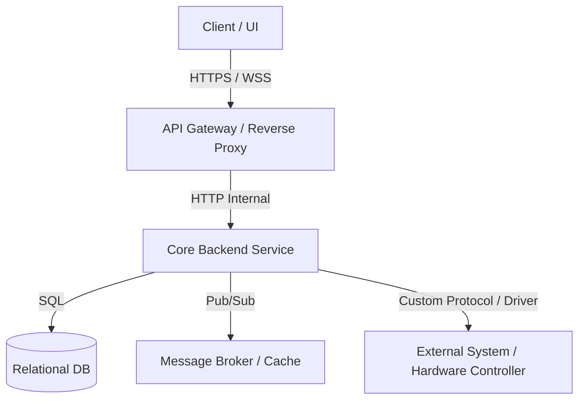

# [Имя проекта]: Физическая архитектура и E2E трассировка (`docs/ARCHITECTURE.md`)

> **Назначение документа**: Фиксация физической топологии, стека технологий, сквозных маршрутов данных (E2E Data Flow) и протоколов взаимодействия. Служит канонической основой для Фазы 2 (Физическая трассировка) SDD-пайплайна.

---

## 1. Технологический стек и инфраструктурный профиль

| Уровень | Технологии / Библиотеки | Назначение в проекте |
| :--- | :--- | :--- |
| **Frontend / Клиент** | *[например: Angular 18 / React 19 / Qt C++]* | Пользовательский интерфейс, представление данных |
| **API Gateway / Прокси** | *[например: Nginx / Traefik / Envoy / Nest Gateway]* | Маршрутизация, TLS, rate limiting, балансировка |
| **Backend / Сервисы** | *[например: Node.js NestJS / Python FastAPI / Go]* | Бизнес-логика, оркестрация процессов |
| **Хранилища данных** | *[например: PostgreSQL 16 + Redis 7]* | Реляционные данные (SSOT) + сессионный кэш |
| **Шины сообщений / Очереди** | *[например: RabbitMQ / Kafka / NATS / Redis Streams]* | Асинхронные события, межсервисная шина |
| **Внешние интерфейсы / HW** | *[например: Serial / CAN / Modbus / Vendor REST API]* | Физические контроллеры, периферия, сторонние API |

---

## 2. Физическая топология системы (Component Topology)



---

## 3. Сквозная трассировка потоков данных (E2E Data Flow)

*Описание сквозных маршрутов прохождения запросов от инициатора до точки фиксации/исполнения.*

### 3.1. Основной командный поток (Command / Mutation Flow)
```
[Клиентский UI / Актор]
  │  1. HTTP POST / PATCH (или WSS Command)
  ▼
[API Gateway / Ingress]
  │  2. Проверка TLS, rate-limit, проброс заголовков авторизации
  ▼
[Guards / Interceptors]
  │  3. Валидация JWT/токена, проверка матрицы прав P(S, A, R, C), валидация схемы DTO
  ▼
[Application Service / Use-Case]
  │  4. Вызов бизнес-логики, проверка доменных инвариантов
  ▼
[Port / Interface]
  │  5. Вызов через слой абстракции (без прямого хардкода драйвера)
  ▼
[Adapter / Driver / ORM Repository]
  │  6. Трансляция вызова в конкретный протокол / SQL-запрос / сетевой пакет
  ▼
[Целевой исполнитель: СУБД / Внешний API / Контроллер]
```

### 3.2. Поток телеметрии и реального времени (Telemetry / Streaming Flow)
*Описать, как данные реального времени поступают от источника к потребителю (push/pull, опрос, стриминг, частота дискретизации).*

---

## 4. Матрица сетевых протоколов и транспортов проекта

*Перечень всех используемых протоколов взаимодействия в проекте:*

| Протокол / Транспорт | Роль в проекте | Формат полезной нагрузки | Сетевой порт / Канал |
| :--- | :--- | :--- | :--- |
| **HTTP/1.1 or HTTP/2** | REST API (CRUD, управление ресурсами) | JSON (RFC 8259) | `:80`, `:443`, `:3000` |
| **WebSocket (WSS)** | Двусторонний real-time обмен, уведомления | JSON / Binary frames | `:443/ws`, `:8080` |
| **[gRPC / Protobuf]** | Высокопроизводительное межсервисное RPC | Binary Protobuf | `:50051` |
| **[Очередь / Брокер]** | Асинхронные события, фоновые воркеры | Message Envelope (JSON/Proto) | `:5672`, `:9092` |
| **[Аппаратный протокол]** | Обмен с контроллерами / платами / датчиками | Binary Frame / Hex / Serial | `/dev/ttyUSB0`, UDP `:14550` |

---

## 5. Слой изоляции и абстракции (Decoupling Points)

*Точки в коде, где конкретная технология скрыта за универсальным интерфейсом (порты и адаптеры):*

1. **Интерфейс хранилища (`Repository Port`)**:
   - Интерфейс: `[UserRepositoryPort]`
   - Текущая реализация: `[PostgresUserRepositoryAdapter]`
   - Цель: легкая замена на In-Memory в тестах или другую СУБД.
2. **Интерфейс внешнего протокола/драйвера (`Driver Port`)**:
   - Интерфейс: `[DeviceCommunicationPort]`
   - Текущая реализация: `[CustomProtocolDriverAdapter]`
   - Цель: изоляция сетевого уровня от бизнес-логики сервиса.

---

## 6. Точки отказа, отказоустойчивость и таймауты (Failure Modes)

| Точка отказа | Риск / Симптом | Механизм защиты / Восстановления |
| :--- | :--- | :--- |
| **Обрыв соединения клиента** | Зависшая сессия, потеря команд | Heartbeat / Ping-Pong таймаут (10с), авто-дисконнект |
| **Недоступность СУБД / Брокера** | Падение обработчиков | Retry с экспоненциальным backoff, Circuit Breaker |
| **Таймаут драйвера/устройства** | Блокировка потока | Строгий deadline (3000мс), возврат ошибки по RFC 7807 |
| **Всплеск нагрузки (Spike)** | Перегрузка памяти | Rate limiting на шлюзе, обратное давление (Backpressure) |
