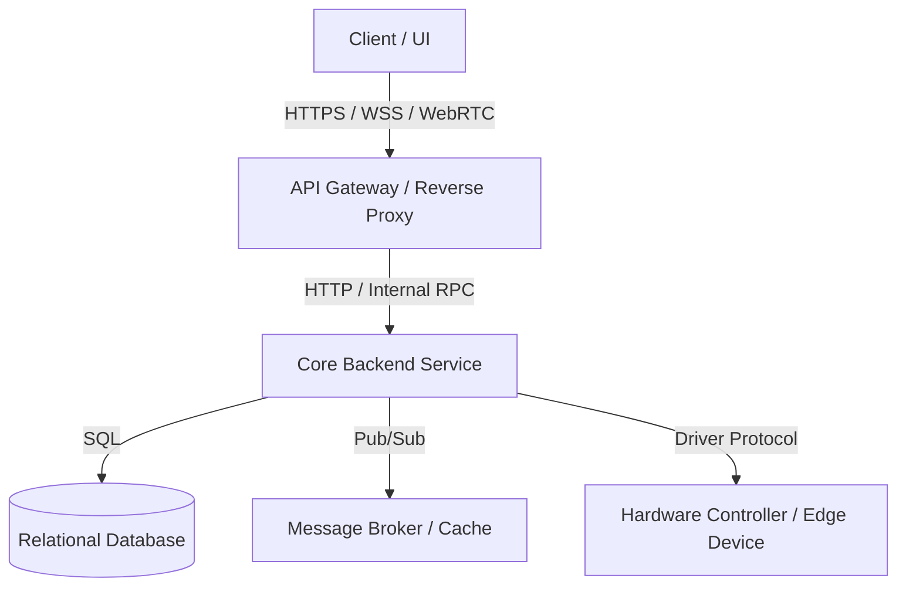

# [Project Name]: Physical Architecture & E2E Tracing (`docs/ARCHITECTURE.md`)

> **Document Purpose**: Documents physical topology, technology stack, end-to-end data flows (E2E), and transport protocols. Serves as the canonical baseline for Phase 2 (Physical Tracing) of the SDD pipeline.

---

## 1. Technology Stack & Infrastructure Profile

| Tier | Technologies & Frameworks | System Role |
| :--- | :--- | :--- |
| **Frontend / Client** | *[e.g., Angular 18 / React 19 / Qt C++]* | User interface, state presentation |
| **API Gateway / Ingress** | *[e.g., Nginx / Traefik / Envoy / Nest Gateway]* | Routing, TLS termination, rate limiting, proxy |
| **Backend Services** | *[e.g., Node.js NestJS / Python FastAPI / Go]* | Domain logic, process orchestration |
| **Data Stores** | *[e.g., PostgreSQL 16 + Redis 7]* | Relational SSOT + session cache & pub/sub |
| **Message Broker** | *[e.g., RabbitMQ / Kafka / NATS / Redis Streams]* | Asynchronous inter-service messaging |
| **Protocols & Hardware** | *[e.g., WSS, WHEP WebRTC, MAVLink, CRSF, Serial]* | Real-time streaming, telemetry, controllers |

---

## 2. Component Topology



---

## 3. End-to-End Data Flow (E2E Tracing)

### 3.1. Command & Mutation Flow
```
[Client UI / Actor]
  │  1. HTTP POST / PATCH (or WSS Command)
  ▼
[API Gateway / Ingress]
  │  2. TLS verification, rate-limit, auth header forward
  ▼
[Guards & Interceptors]
  │  3. JWT validation, P(S, A, R, C) policy check, DTO schema validation
  ▼
[Application Service / Use Case]
  │  4. Business logic execution, domain invariant checks
  ▼
[Port / Interface]
  │  5. Invocation through abstraction layer
  ▼
[Adapter / Driver / Repository]
  │  6. Translation to protocol packet / SQL query / external payload
  ▼
[Target Target: Database / Edge Device / External API]
```

### 3.2. Telemetry & Real-Time Streaming Flow
*Describe real-time data flow from source to consumer (push/pull, polling, streaming, sampling rate).*

---

## 4. Network Protocols & Transports Matrix

| Protocol / Transport | System Role | Payload Format | Port / Channel |
| :--- | :--- | :--- | :--- |
| **HTTP/1.1 or HTTP/2** | REST API (CRUD, resource lifecycle) | JSON (RFC 8259) | `:80`, `:443`, `:3000` |
| **WebSocket (WSS)** | Bidirectional real-time messaging, events | JSON / Binary Frames | `:443/ws`, `:8080` |
| **WebRTC (WHEP/WHIP)** | Low-latency video / media streaming | H.264 / Opus / RTP | UDP `:8554` |
| **[Message Broker]** | Async task queues, service bus | Message Envelope | `:5672`, `:9092` |
| **[Hardware Protocol]** | Controller communication (MAVLink, CRSF) | Binary Packet / Serial | `/dev/ttyUSB0`, UDP `:14550` |

---

## 5. Decoupling & Abstraction Points

*Code locations where underlying technologies are isolated behind ports and adapters:*

1. **Repository Interface (`Repository Port`)**:
   - Interface: `[UserRepositoryPort]`
   - Implementation: `[PostgresUserRepositoryAdapter]`
   - Objective: Enables in-memory test substitution or database engine migration.
2. **Driver Interface (`Driver Port`)**:
   - Interface: `[DeviceCommunicationPort]`
   - Implementation: `[CustomProtocolDriverAdapter]`
   - Objective: Insulates business use cases from transport details.

---

## 6. Failure Modes, Resiliency & Timeouts

| Failure Mode | Risk & Symptom | Defense & Recovery Mechanism |
| :--- | :--- | :--- |
| **Client Disconnect** | Orphaned session, stalled commands | Heartbeat timeout (10s), auto-disconnect |
| **DB / Broker Unavailable** | Unhandled request failures | Exponential backoff retry, Circuit Breaker |
| **Hardware Driver Timeout** | Thread or event loop blockage | Strict deadline (3000ms), return RFC 7807 error |
| **Traffic Surge** | Memory exhaustion | Ingress rate limiting, backpressure flow control |
